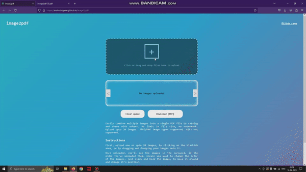

A simple image to PDF converting website with a carousel that allows you to drag and re-order images. Add up-to 20 images in one go and convert them into a PDF. No file size limit. Conversion happens within the browser, using jsPDF library.

## Demo


## How to use
- First, upload one or upto 20 images, by clicking on the dark area, or by dragging and dropping your images onto it.
- Once uploaded, you'll see the images in the carousel, in the order you've uploaded them. Incase you want to change the order of the images, just click and hold the image, to move it around and change it's position.
- Once, you have them in your desired order, you can click on the download button, to download the images as a PDF.

## Supported image formats
- JPEG
- PNG

## Features
- Re-orderable image carousel.
- Touch support.

## Dependencies
- jsPDF
```
npm i jsPDF
```

## Site link
### https://anshuthopsee.github.io/image2pdf/
